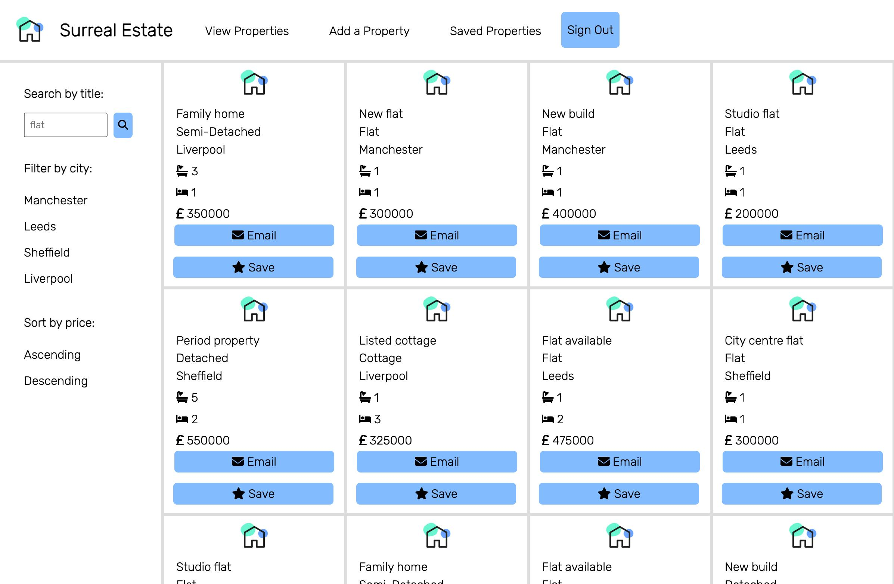

# Portfolio

 

I built this portfolio using React and JavaScript. It was created using the npx script `create-react-app`. I wrote the tests using Jest and React Testing Library.

## Getting started

- Create a fork of this repo.
- Copy the fork's git address and clone to your machine using git clone.
- Use `npm install` to download the dependencies.
- Use `npm test` to run the tests.
- Use `npm start` to run the app in your browser.
