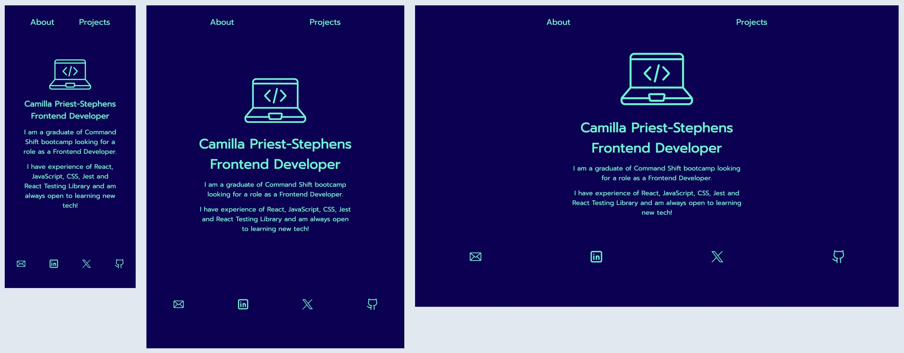

# Portfolio

 

- I created this portfolio using `create-react-app` and built it with React and JavaScript. 
- I wrote the tests using Jest and React Testing Library.
- I've included descriptions and links for three React projects: Cocktail Companion, Surreal Estate (in progress) and Weather App.

[Click here to visit my portfolio site.](https://camillaprieststephens.com/)

## Installation

- Create a fork of this repo.
- Copy the fork's git address and clone to your machine using git clone.
- Use `npm install` to download the dependencies.
- Use `npm test` to run the tests.
- Use `npm start` to run the app in your browser.
